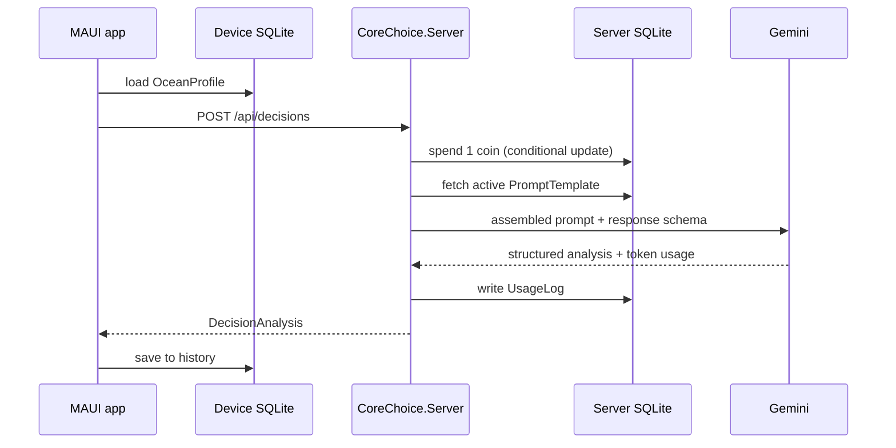

# CoreChoice — Vertical Slice Design

**Date:** 2026-09-15
**Status:** Approved
**Scope:** One end-to-end path — personality test to personalized decision analysis — with a real coin
ledger. Play Billing, the signed release, and prompt administration are deferred to their own specs.

## Context

CoreChoice is an Android application that attacks decision fatigue. A person takes a Big Five (OCEAN)
personality test, states a dilemma as two options, chooses an advisor persona, and receives an analysis
from Google Gemini that is shaped by their personality profile rather than generic.

The architecture deliberately mirrors PurePrep, a shipped application by the same author running on the
same Hetzner VPS. That decision is about reducing novelty, not about reuse for its own sake: the
deployment, the credit ledger, the Gemini integration, and the Android build recipe are all solved
problems there, and solved problems are cheaper than good ideas.

Three premises from the original brief were corrected against what PurePrep actually contains:

- **MediatR / CQRS.** PurePrep uses none. It routes minimal APIs to static handler classes and keeps
  port interfaces in an application layer. CoreChoice follows suit. MediatR's behaviour pipeline is a
  genuine fit for cross-cutting coin deduction, but it is a new dependency with a commercial licence
  above a revenue threshold, and the slice has three endpoints.
- **PostgreSQL.** PurePrep runs SQLite on a mounted Docker volume. CoreChoice does the same. A Postgres
  container is new infrastructure on a box that does not currently need it.
- **User accounts.** PurePrep has none. Identity is a client-generated GUID held in secure storage.
  CoreChoice inherits this: no authentication surface, no password reset, no personal data at rest.

## Product invariants

These are not preferences to be traded away under pressure. They constrain every later decision in this
codebase, and a change to one of them is a change to what the product is.

**The personality test and its full result are free, permanently and unconditionally.** Completing the
50 items always shows the complete OCEAN profile: all five trait scores and their interpretation. No
coin is spent, no balance is checked, no account is required, and no part of the result is blurred,
truncated, or held back. The scoring runs on the device and the result is rendered from local data, so
there is no code path on which a server response could gate it even by accident.

The competing products in this category ask for ten minutes of honest self-disclosure and then put the
result behind a payment screen. That is why their completion rates are poor and their reviews are
bitter: people sense the wall coming and stop answering. CoreChoice does not do this. The test is the
thing that earns trust; charging for it would spend that trust to collect a few euros.

Coins buy **decision analyses** — the Gemini call, which is the part that costs real money to serve.
That is the only thing they buy. This boundary is worth stating in the UI before the test begins, not
only in the specification, because a person who has been burned before will assume the wall is coming
unless told otherwise.

## Decisions

| Area | Decision |
|---|---|
| Database | SQLite on a Docker volume, schema via `SchemaInitializer`. No EF migrations. |
| Backend pattern | Minimal APIs, static endpoint handlers, ports in `Core/Application`. |
| Identity | Anonymous device GUID in secure storage. No accounts. |
| Personality instrument | IPIP Big-Five Factor Markers, 50 items, public domain. |
| Data at rest (server) | Device GUID, persona, weight, token counts, cost, outcome. Never the profile or the dilemma. |
| Decision history | On-device SQLite only. |
| Coin economy | Real ledger in this slice. Play Billing deferred. Coins buy analyses only, never the test result. |
| Deployment | One container on Coldstart's shared Caddy network, as PurePrep does. |

## Architecture

Three projects plus two test projects, mirroring PurePrep's layout so that navigating one codebase
teaches the other.

```
src/CoreChoice.Core/            net10.0 — referenced by both app and server
    Domain/                     no external dependencies
    Application/                port interfaces, application exceptions
    Infrastructure/             adapters used by the MAUI app
    Ai/                         Gemini client, prompt assembly, response schema
src/CoreChoice.Server/          net10.0 ASP.NET Core minimal API
    Endpoints/                  static handler classes
    Data/                       entities, DbContext, schema initializer, prompt seed
    Services/                   coin store, prompt store, free-coin policy, IP hashing
src/CoreChoice/                 net10.0-android MAUI application
tests/CoreChoice.Core.Tests/
tests/CoreChoice.Server.Tests/
```

`CoreChoice.Core` is shared by the app and the server, as `PurePrep.Core` is. Its `Domain` folder takes
no dependency on Entity Framework, ASP.NET Core, or any SDK; `Infrastructure` holds the adapters the
MAUI application needs, and the server supplies its own.

### Domain

- `TraitScore` — a value object wrapping one trait's score with its valid range. A `record`.
- `OceanProfile` — the five trait scores. A `record`. Exposes `OceanProfile.None` for the
  not-yet-tested state, so "is this person profiled?" is answered by the type rather than by a null
  check repeated across view models and prompt assembly.
- `IpipScoring` — pure scoring of 50 Likert responses into an `OceanProfile`. Owns reverse-key
  handling and rejects incomplete submissions.
- `Dilemma` — the two options and their optional context. A `record`. Enforces non-empty options and a
  maximum length, because the option text is prompt input and unbounded input is a cost problem.
- `DecisionWeight` — the 1-to-5 slider as a value object that refuses values outside its range.
- `PersonaId` — the advisor persona. A closed set: devil's advocate, warm support, pure logic.
- `DecisionAnalysis` — the structured result. A `record`.

### Application ports

Inbound and outbound ports live here, not in `Infrastructure`.

- `IDecisionAdvisor` — request an analysis. Implemented by an HTTP adapter in the app, and by the
  Gemini-backed service on the server.
- `IProfileRepository` — load, save, and partially save personality answers on the device.
- `ICoinLedgerClient` — balance and spend, from the app's perspective.
- `IDeviceIdentity` — the stable device GUID.
- `IVoiceDictation` — speech to text, implemented per platform.
- `InsufficientCoinsException`, `DecisionUnavailableException` — application-level failures the UI
  renders differently from a transport error.

Every port method that performs IO takes a `CancellationToken` and returns `Task`. No method returns
`IQueryable`.

### Server

`Endpoints/DecisionEndpoint.Generate` is the centre of the slice:

1. Validate the request and reject malformed or oversized input before spending anything.
2. Spend one coin atomically — a conditional `UPDATE … WHERE Balance >= @amount`, so two concurrent
   requests cannot both succeed against a balance of one.
3. Fetch the active `PromptTemplate` for the requested persona.
4. Assemble the prompt: template, plus the profile if present, plus the dilemma as clearly-delimited
   untrusted data.
5. Call Gemini with a response schema.
6. Write a `UsageLog` row recording the token counts Gemini reports, the resolved cost, the prompt
   version used, and the outcome.
7. Return the analysis. On any failure after step 2, refund the coin before propagating.

`CoinsEndpoint` exposes balance and a first-contact seed of free coins, subject to a per-origin cap
keyed on a salted hash of the client address — never the address itself. `DevEndpoint` grants coins
behind a shared-secret filter and closes entirely when the secret is unset.

### Prompts in the database

`PromptTemplate(PersonaId, Version, Template, IsActive, CreatedAt)` with the active template per persona
unique. `PromptSeed` inserts the initial templates at startup when the table is empty, so a freshly
provisioned container is never promptless — a failure mode that would otherwise appear only in
production, only on the first deploy, and only as a 500.

Changing a prompt means inserting a new version and flipping `IsActive`. No redeploy. `UsageLog` records
the version that produced each answer, so the question "did that prompt change help?" has an answer.

### Gemini integration

A structured response schema constrains the model's output:

```
recommendation      string
confidence          number
reasoning           string[]
optionA             { strengths: string[], risks: string[] }
optionB             { strengths: string[], risks: string[] }
personalityNote     string
```

`personalityNote` is the line that makes the analysis feel addressed to this person rather than
assembled for anyone, and it is what the loading screen's copy is built to pay off.

The dilemma text is untrusted input travelling to a language model. Two defences, both carried over from
PurePrep's client: the template states explicitly that the user-supplied section is data and never
instructions, and the response schema means a hijacked generation fails to parse rather than escaping
into the response. A parse failure refunds the coin.

When no Gemini key is configured the server registers a fake client, so the application runs end to end
locally without a key and the integration tests need no network.

### MAUI application

- `OnboardingViewModel` — the 50-item test, paged roughly five items per screen with a progress
  indicator. Answers persist per item rather than on submit, so the test survives an interruption and
  reopens on the item last seen. The test is offered at first launch and can be declined. Its opening
  screen states that the result is free and always will be, and the closing screen spends no coin and
  checks no balance.
- `ProfileViewModel` — the full OCEAN result: all five trait scores with their interpretation, shown
  immediately on completion and available thereafter. Rendered entirely from local data. It takes no
  dependency on `ICoinLedgerClient`, which makes the free-result invariant structural rather than a
  matter of remembering.
- `DilemmaViewModel` — two option fields, a persona picker, a 1-to-5 weight slider, and a dictation
  button bound to `IVoiceDictation`.
- `AnalysisViewModel` — renders `DecisionAnalysis`, and states plainly when an analysis was generic.
- `CoinsViewModel` — balance and history. The purchase path is stubbed in this slice.

The loading screen composes its messages from the local profile — naming the trait actually being
weighed against the option actually under consideration. It needs no server round-trip, which is why it
can start the moment the request is sent.

### First-run behaviour

The application opens on the dilemma screen, not on the test. A person can explore before committing ten
minutes. When the test is offered, the offer says in plain words that the result costs nothing — the
objection to a ten-minute questionnaire is rarely the ten minutes, it is the suspicion of what waits at
the end.

The first analysis is available without a profile and is labelled generic. Subsequent personalized
analyses require the completed test. The generic answer demonstrates the product, and the difference
between it and a personalized one is the argument for taking the test — a better argument than a wall
raised at the moment of highest intent. The free-coin ledger already bounds the cost of that taste.

## Data flow



## Error handling

| Failure | Response |
|---|---|
| Malformed or oversized request | 400 before any spend |
| Insufficient coins | 402, no spend, app offers the coins screen |
| Gemini unavailable or times out | Coin refunded, 503, app offers retry |
| Gemini returns unparseable output | Coin refunded, 502, logged with the prompt version |
| Rate limit exceeded | 429, no spend |
| Concurrent spend against a balance of one | Exactly one succeeds; the conditional update guarantees it |

Every path that spends a coin refunds it on failure. The ledger is the thing a person notices going
wrong, and a silently burned coin costs more trust than a visible error.

## Testing

xUnit, NSubstitute, and FluentAssertions. Outbound ports are mocked; domain types are instantiated
directly, never mocked. Naming follows `MethodName_StateUnderTest_ExpectedBehavior`, with strict
Arrange / Act / Assert sections. Every class gets at least one happy path and two failure or edge cases.

The heaviest coverage sits on:

- `IpipScoring` — reverse-keyed items, per-trait aggregation, incomplete submissions. This is where a
  personality-test implementation goes quietly wrong, producing plausible numbers that are simply the
  wrong numbers.
- Coin spend and refund under concurrency.
- `PromptAssembler` — profiled and unprofiled assembly, and that user text lands in the delimited
  untrusted section.
- `DecisionEndpoint` through an application factory backed by an in-memory database and the fake Gemini
  client, covering each row of the error table above.
- The free-result invariant: scoring and rendering a completed test with a coin balance of zero
  produces the full profile, and the ledger is untouched. Written as a test rather than trusted to
  discipline, because this is the invariant most likely to be eroded later by a plausible-sounding
  growth argument.

## Deployment

A multi-stage Dockerfile as PurePrep's, publishing to the ASP.NET runtime image, with SQLite on a
mounted volume at `/data`. The compose service joins Coldstart's existing external network so its Caddy
terminates TLS and routes to the container; no second reverse proxy.

The compose service is named `corechoice`. Compose registers the service name as a DNS alias on the
shared network, and a generic name silently hijacks another stack's traffic — PurePrep's compose file
carries a comment about exactly this, written after `web` broke a neighbouring site.

Secrets arrive as environment variables at runtime and are absent from the image: the Gemini key, the
development grant secret, and the salt behind the origin hash. The salt must stay stable across deploys
or the free-coin cap resets with every release.

## Out of scope

Deferred, each to its own specification:

- Google Play Billing and the purchase-validation path.
- The signed `.aab` release and store assets.
- Prompt administration endpoints.
- Cross-device synchronisation, which the local-first data policy rules out by design.
